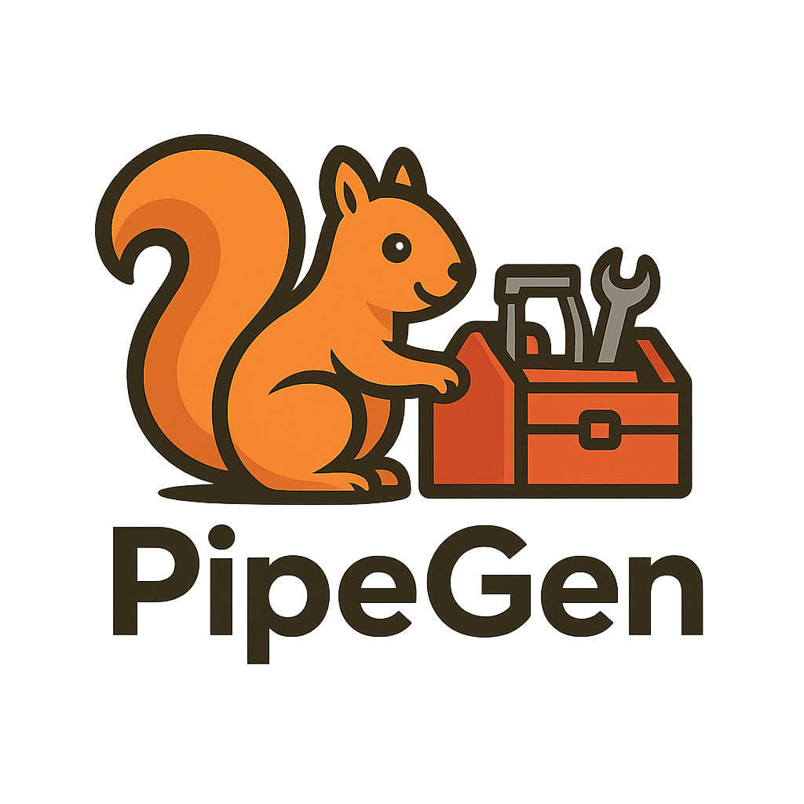

# PipeGen

<div align="center">
  
</div>

A powerful CLI tool for creating and managing streaming data pipelines using Apache Kafka and FlinkSQL. Designed for local development with a complete Docker-based stack, AI-powered pipeline generation, and real-time monitoring dashboard. 

## Features

- 🚀 **Project scaffolding** - Generate complete project structure with SQL and AVRO schemas
- 🐳 **Local development** - Complete Docker Compose stack with Kafka, Flink, and Schema Registry
- 🤖 **AI-powered generation** - Describe your pipeline in natural language and let AI create optimized components
- � **Custom schemas** - Use your own AVRO schemas or generate defaults
- 📊 **Smart producer** - Generate realistic test data matching any schema structure
- 👂 **Kafka consumer** - Validate pipeline output with built-in message validation
- ⚡ **FlinkSQL deployment** - Deploy and manage FlinkSQL jobs locally or in the cloud
- 🏷️ **Dynamic resources** - Create unique topic names to avoid conflicts
- 🧹 **Auto cleanup** - Remove all created resources after testing
- ✅ **Validation** - Validate project structure, SQL syntax, and AVRO schemas

## Installation

### Quick Install (Recommended)

```bash
curl -sSL https://raw.githubusercontent.com/owner/pipegen/main/install.sh | bash
```

Or download manually from [releases](https://github.com/owner/pipegen/releases).

### Alternative Methods

#### Using Go Install
```bash
go install github.com/owner/pipegen@latest
```

#### From Source
```bash
git clone https://github.com/owner/pipegen.git
cd pipegen
go build -o pipegen ./cmd/main.go
```

#### Manual Download
1. Download the appropriate binary for your platform from the [releases page](https://github.com/owner/pipegen/releases)
2. Extract and move to your PATH:
   ```bash
   # Linux/macOS
   sudo mv pipegen /usr/local/bin/
   
   # Verify installation
   pipegen version
   ```

## Quick Start

### Local Development

1. **Initialize a new project**:
   ```bash
   pipegen init my-streaming-pipeline
   cd my-streaming-pipeline
   ```

2. **Deploy local stack** (Kafka + Flink + Schema Registry):
   ```bash
   pipegen deploy
   ```

3. **Run the pipeline**:
   ```bash
   pipegen run --message-rate 100 --duration 2m
   ```

4. **Clean up**:
   ```bash
   docker-compose down -v
   ```

### AI-Powered Pipeline Generation

```bash
# Let AI generate your pipeline from a description
pipegen init fraud-detection --describe "Monitor payment transactions, detect suspicious patterns using machine learning, and alert on potential fraud within 30 seconds"

# Add domain context for better results
pipegen init user-analytics --describe "Track user sessions and calculate conversion funnels" --domain "ecommerce"
```

## Commands

### `pipegen init <project-name>`

Creates a new streaming pipeline project with:
- SQL statements for FlinkSQL processing
- AVRO schemas for message serialization
- Configuration template (local mode by default)
- Docker Compose setup for local development

**Flags:**
- `--force` - Overwrite existing directory
- `--input-schema <path>` - Use custom AVRO schema file instead of generating default
- `--describe <text>` - Natural language description for AI-powered generation (requires PIPEGEN_OLLAMA_MODEL or PIPEGEN_OPENAI_API_KEY)
- `--domain <domain>` - Business domain for better AI context (e.g., ecommerce, fintech, iot)

**Examples:**
```bash
# Default project with generated schema
pipegen init my-pipeline

# Project with custom input schema
pipegen init ecommerce --input-schema ./click-events.avsc

# AI-generated pipeline
pipegen init realtime-alerts --describe "Process IoT sensor data and trigger alerts when temperature exceeds threshold for 5 minutes"

# AI-generated with domain context
pipegen init conversion-tracking --describe "Track user journey and calculate conversion rates" --domain "ecommerce"
```

### `pipegen deploy`

Deploys the local Docker stack:
- Starts Kafka, Flink, and Schema Registry
- Creates topics and registers schemas
- Deploys FlinkSQL jobs
- Provides service URLs and management commands

**Flags:**
- `--project-dir` - Project directory (default: ".")
- `--clean` - Clean existing containers before deploying
- `--detach` - Run containers in detached mode (default: true)
- `--with-schema-registry` - Deploy with Schema Registry (default: true)
- `--startup-timeout` - Timeout for stack startup (default: 2m)

### `pipegen run`

Executes the complete streaming pipeline:
1. Creates dynamic Kafka topics
2. Registers AVRO schemas
3. Deploys FlinkSQL statements
4. Starts producer and consumer
5. Monitors execution
6. Cleans up resources

**Flags:**
- `--project-dir` - Project directory (default: ".")
- `--message-rate` - Messages per second (default: 100)
- `--duration` - Pipeline runtime (default: 5m)
- `--cleanup` - Clean up resources after run (default: true)
- `--dry-run` - Show execution plan without running
- `--dashboard` - Start live dashboard during pipeline execution
- `--dashboard-port` - Dashboard server port when using --dashboard (default: 3000)

**Examples:**
```bash
# Basic pipeline execution
pipegen run

# Run with live dashboard monitoring
pipegen run --dashboard

# High-throughput test with dashboard
pipegen run --message-rate 1000 --duration 10m --dashboard

# Custom dashboard port
pipegen run --dashboard --dashboard-port 8080
```

### `pipegen validate`

Validates project structure and configuration:
- Checks required directories and files
- Validates SQL syntax
- Validates AVRO schema format
- Verifies configuration completeness
- Tests connectivity (when specified)

**Flags:**
- `--project-dir` - Project directory to validate
- `--check-connectivity` - Test Kafka/Schema Registry connectivity

### `pipegen dashboard`

Starts a live monitoring dashboard with real-time metrics visualization:
- **Real-time pipeline monitoring** - WebSocket-based live updates every second
- **Comprehensive metrics** - Kafka, Flink, producer, consumer, and execution metrics
- **Interactive pipeline diagram** - Visual representation of data flow with status indicators
- **Error tracking** - Real-time error detection with resolution suggestions
- **Performance analytics** - Latency percentiles, throughput trends, and resource utilization
- **Data quality monitoring** - Schema validation, record quality scores, and anomaly detection
- **Exportable reports** - Generate comprehensive HTML reports with charts and diagrams
- **Live logs** - Real-time log streaming with filtering and search capabilities

**Flags:**
- `--port` - Dashboard server port (default: 3000)
- `--standalone` - Start dashboard without running pipeline
- `--open` - Automatically open dashboard in browser (default: true)
- `--project-dir` - Project directory path

**Examples:**
```bash
# Start dashboard with pipeline execution
pipegen dashboard

# Start on custom port
pipegen dashboard --port 8080

# Start dashboard without running pipeline (monitoring existing services)
pipegen dashboard --standalone

# Monitor specific project
pipegen dashboard --project-dir ./my-pipeline
```

### `pipegen check`

Checks AI provider configuration and connectivity:
- Detects configured AI providers (Ollama/OpenAI)
- Tests connectivity to AI services  
- Verifies model availability
- Provides setup instructions for AI features

**Example:**
```bash
pipegen check
# Output: Reports AI provider status and provides setup guidance
```

### `pipegen validate`
```

## Configuration

### Local Development

The `.pipegen.yaml` file for local development:

```yaml
# Local services (Docker Compose)
bootstrap_servers: "localhost:9092"
flink_url: "http://localhost:8081"
schema_registry_url: "http://localhost:8082"

# Pipeline Configuration
default_message_rate: 100
default_duration: "5m"
topic_prefix: "my-pipeline"
cleanup_on_exit: true
```

### Cloud-Ready Templates

PipeGen can generate FlinkSQL templates with cloud-compatible configurations for manual deployment to cloud platforms like Confluent Cloud. These templates include proper SASL authentication and Schema Registry integration, but require manual setup on your cloud platform.

### Global Flags

All commands support these global flags:
- `--bootstrap-servers` - Kafka bootstrap servers (default: localhost:9092)
- `--flink-url` - Flink Job Manager URL (default: http://localhost:8081)
- `--schema-registry-url` - Schema Registry URL (default: http://localhost:8082)
- `--config` - Custom config file path

### Environment Variables

You can also use environment variables (they override config file values):

```bash
export PIPEGEN_BOOTSTRAP_SERVERS="localhost:9092"
export PIPEGEN_FLINK_URL="http://localhost:8081"
export PIPEGEN_SCHEMA_REGISTRY_URL="http://localhost:8082"

# For AI-powered features (choose one)

# Option 1: Ollama (local, free)
export PIPEGEN_OLLAMA_MODEL="llama3.1"        # or codellama, llama3, etc.
export PIPEGEN_OLLAMA_URL="http://localhost:11434"  # Optional, defaults to localhost

# Option 2: OpenAI (cloud, requires API key)
export PIPEGEN_OPENAI_API_KEY="your-openai-api-key"
export PIPEGEN_LLM_MODEL="gpt-4"  # Optional, defaults to gpt-4
```

## 📊 Live Dashboard & Reporting

PipeGen includes a sophisticated monitoring dashboard that provides real-time visibility into your streaming pipeline performance.

### Dashboard Features

#### Real-Time Monitoring
- **Live Metrics Updates** - WebSocket-based updates every second
- **Pipeline Flow Visualization** - Interactive diagram showing data flow from producer to consumer
- **System Health Monitoring** - Kafka cluster, Flink jobs, and service status
- **Performance Trends** - Real-time charts of throughput, latency, and error rates

#### Comprehensive Metrics
- **Kafka Metrics** - Broker health, topic statistics, partition details, consumer lag
- **Flink Metrics** - Job status, checkpoint statistics, CPU/memory usage, backpressure
- **Producer Metrics** - Messages sent, throughput, success rate, latency distribution  
- **Consumer Metrics** - Messages consumed, processing time, offset lag, commit rate
- **Data Quality** - Schema violations, record validation, quality scores

#### Error Management
- **Real-Time Error Detection** - Immediate notification of pipeline issues
- **Contextual Error Information** - Component, timestamp, severity, and detailed messages
- **Resolution Suggestions** - AI-powered suggestions for common error patterns
- **Error Categorization** - Organized by component (Kafka, Flink, Producer, Consumer)

#### Reporting & Export
- **HTML Report Generation** - Comprehensive reports with charts and diagrams
- **Pipeline Diagrams** - ASCII art and visual representations of architecture
- **Performance Analytics** - Latency percentiles, throughput analysis, resource utilization
- **Executive Summary** - High-level metrics and KPIs for stakeholders

### Getting Started with Dashboard

#### Quick Start
```bash
# Run pipeline with integrated dashboard
pipegen run --dashboard

# Start standalone dashboard (monitor existing services)  
pipegen dashboard --standalone

# Custom port and project
pipegen dashboard --port 8080 --project-dir ./my-pipeline
```

#### Dashboard URLs
When running, the dashboard provides several endpoints:

- **Main Dashboard**: `http://localhost:3000/` - Real-time monitoring interface
- **Pipeline Report**: `http://localhost:3000/report` - Comprehensive HTML report  
- **Pipeline Diagram**: `http://localhost:3000/diagram` - Interactive architecture diagram
- **Metrics API**: `http://localhost:3000/api/metrics` - Raw metrics in JSON format
- **Export Report**: `http://localhost:3000/api/export` - Download HTML report

#### Dashboard Components

**Pipeline Flow Visualization**
```
📤 Producer → 🔄 Kafka → ⚡ Flink → 📥 Output → 👂 Consumer
```
- Real-time status indicators with color coding
- Throughput rates and message counts
- Error states and processing bottlenecks

**Key Metrics Panel**
- Total messages processed
- Current throughput (msg/sec)  
- Success rate percentage
- Average end-to-end latency

**System Health Panel**
- Kafka broker count and status
- Flink TaskManager availability
- Active error count
- Resource utilization

**Performance Charts**
- Real-time throughput trends
- Latency distribution histograms  
- Error rate over time
- Resource usage graphs

**Live Logs**
- Real-time log streaming
- Component-based filtering
- Search and highlighting
- Automatic scrolling and cleanup

### Dashboard Configuration

#### Environment Variables
```bash
# Dashboard server settings
export PIPEGEN_DASHBOARD_PORT=3000
export PIPEGEN_DASHBOARD_AUTO_OPEN=true

# Metrics collection intervals  
export PIPEGEN_KAFKA_METRICS_INTERVAL=2s
export PIPEGEN_FLINK_METRICS_INTERVAL=3s

# WebSocket configuration
export PIPEGEN_WEBSOCKET_UPDATE_INTERVAL=1s
```

#### Advanced Features

**Customizable Alerts**
- Set custom thresholds for metrics
- Email/webhook notifications
- Alert escalation policies  

**Historical Data**
- Metric storage and retrieval
- Trend analysis over time
- Comparative reporting

**Multi-Pipeline Monitoring** 
- Monitor multiple pipelines simultaneously
- Cross-pipeline correlation analysis
- Aggregated dashboard views

### Performance Impact

The dashboard is designed to have minimal impact on pipeline performance:
- **CPU Usage**: <2% additional overhead
- **Memory**: ~50MB for dashboard server
- **Network**: <1KB/sec for WebSocket updates
- **Storage**: Metrics stored in memory with configurable retention

### Browser Compatibility

| Browser | Supported | WebSocket | Charts |
|---------|-----------|-----------|--------|
| Chrome 90+ | ✅ Full | ✅ | ✅ |
| Firefox 88+ | ✅ Full | ✅ | ✅ |  
| Safari 14+ | ✅ Full | ✅ | ✅ |
| Edge 90+ | ✅ Full | ✅ | ✅ |

### Troubleshooting Dashboard

**Dashboard won't start**
- Check if port is already in use: `lsof -i :3000`
- Verify Go modules are installed: `go mod tidy`
- Check firewall settings for the dashboard port

**WebSocket connection failed** 
- Verify dashboard server is running
- Check browser console for error messages
- Ensure no proxy is blocking WebSocket connections

**Metrics not updating**
- Check if Kafka/Flink services are accessible
- Verify service URLs in configuration
- Check metrics collector logs for connection errors

**Browser auto-open failed**
- Manually navigate to `http://localhost:3000`
- Check if default browser is set correctly
- Use `--open=false` flag to disable auto-open

## AI-Powered Features

PipeGen includes optional AI capabilities for intelligent pipeline generation using either local Ollama or cloud OpenAI:

### Setup Options

#### Option 1: Ollama (Recommended - Local & Free)
1. Install Ollama: `curl -fsSL https://ollama.com/install.sh | sh`
2. Pull a model: `ollama pull llama3.1` (or `codellama`, `llama3`, etc.)
3. Set the environment variable: `export PIPEGEN_OLLAMA_MODEL="llama3.1"`
4. Use the `--describe` flag with natural language descriptions

#### Option 2: OpenAI (Cloud)
1. Get an OpenAI API key from [OpenAI Platform](https://platform.openai.com/)
2. Set the environment variable: `export PIPEGEN_OPENAI_API_KEY="your-key"`
3. Use the `--describe` flag with natural language descriptions

### Recommended Models

| Provider | Model | Best For | Setup |
|----------|--------|----------|-------|
| **Ollama** | `llama3.1` | General streaming pipelines | `ollama pull llama3.1` |
| **Ollama** | `codellama` | Code-heavy SQL generation | `ollama pull codellama` |
| **OpenAI** | `gpt-4` | Complex business logic | API key required |
| **OpenAI** | `gpt-3.5-turbo` | Simple pipelines (faster/cheaper) | API key required |

### What AI Generates
- **Optimized AVRO schemas** based on your domain and use case
- **Custom FlinkSQL statements** with proper windowing, aggregations, and joins
- **Performance optimizations** suggestions for your specific pipeline
- **Documentation** explaining the generated components

### Example Use Cases
```bash
# E-commerce analytics (using Ollama)
export PIPEGEN_OLLAMA_MODEL="llama3.1"
pipegen init sales-analytics --describe "Track product purchases, calculate revenue metrics, and identify trending products" --domain "ecommerce"

# IoT monitoring (using OpenAI)
export PIPEGEN_OPENAI_API_KEY="your-key"
pipegen init sensor-monitoring --describe "Process temperature and humidity sensors, detect anomalies, and send alerts" --domain "iot"

# Financial fraud detection (using CodeLlama for complex SQL)
export PIPEGEN_OLLAMA_MODEL="codellama"
pipegen init fraud-detection --describe "Analyze payment transactions in real-time, detect suspicious patterns, and alert on potential fraud" --domain "fintech"

# Social media analytics
pipegen init engagement-analytics --describe "Process user interactions, calculate engagement rates, and identify viral content" --domain "social"
```

### Quick Start with AI

```bash
# 1. Install and setup Ollama (one time)
curl -fsSL https://ollama.com/install.sh | sh
ollama pull llama3.1

# 2. Verify AI setup
export PIPEGEN_OLLAMA_MODEL="llama3.1"
pipegen check  # Should show "AI provider is ready!"

# 3. Generate your first AI pipeline
pipegen init my-pipeline --describe "Process user events and calculate hourly activity metrics"

# 4. Deploy and test
cd my-pipeline
pipegen deploy
pipegen run
```

## Project Structure

```
my-streaming-pipeline/
├── .pipegen.yaml          # Configuration file
├── docker-compose.yml     # Local Docker stack (generated)
├── flink-conf.yaml        # Flink configuration (generated)
├── README.md              # Project documentation
├── sql/                   # FlinkSQL statements
│   ├── 01_create_source_table.sql
│   ├── 02_create_processing.sql
│   ├── 03_create_output_table.sql
│   └── 04_insert_results.sql
├── schemas/               # AVRO schemas
│   ├── input_event.avsc   # Input schema (custom or generated)
│   └── output_result.avsc # Output schema (generated)
└── deployed-sql/          # Deployed SQL files (runtime)
```

## Custom Input Schemas

PipeGen supports using your own AVRO schemas for input events:

### Using Custom Schema

```bash
# Create project with custom schema
pipegen init my-project --input-schema ./my-schema.avsc
```

The tool will:
- Copy your schema to `schemas/input_event.avsc`
- Generate appropriate SQL statements
- Create a smart producer that generates test data matching your schema fields

### Supported Field Patterns

The producer automatically generates realistic data for common field patterns:

| Field Name Pattern | Generated Data |
|-------------------|----------------|
| `*_id`, `*id` | Unique identifiers |
| `user_id` | User identifiers (user-1, user-2, etc.) |
| `session_id` | Session identifiers |
| `event_type` | Random event types |
| `click_type` | Button, Link, Image, Menu |
| `page_url` | Sample URLs |
| `timestamp*` | Current timestamp |
| `properties`, `metadata` | Sample key-value maps |

### Example Custom Schema

```json
{
  "type": "record",
  "name": "UserClickEvent",
  "namespace": "ecommerce.events",
  "fields": [
    {"name": "session_id", "type": "string"},
    {"name": "user_id", "type": "string"},
    {"name": "page_url", "type": "string"},
    {"name": "click_type", "type": {"type": "enum", "symbols": ["BUTTON", "LINK"]}},
    {"name": "timestamp", "type": {"type": "long", "logicalType": "timestamp-millis"}},
    {"name": "metadata", "type": {"type": "map", "values": "string"}}
  ]
}
```
## SQL Statement Variables

FlinkSQL statements support variable substitution for local development:

### Local Development Variables
- `${INPUT_TOPIC}` - Input topic name (input-events)
- `${OUTPUT_TOPIC}` - Output topic name (output-results)
- Local endpoints are automatically configured

### Cloud Template Variables (for manual deployment)
Generated SQL templates include variables for cloud deployment:
- `${INPUT_TOPIC}` - Dynamic input topic name
- `${OUTPUT_TOPIC}` - Dynamic output topic name
- `${BOOTSTRAP_SERVERS}` - Kafka bootstrap servers
- `${API_KEY}` - Cloud API key
- `${API_SECRET}` - Cloud API secret
- `${SCHEMA_REGISTRY_URL}` - Schema Registry URL
- `${SCHEMA_REGISTRY_KEY}` - Schema Registry API key
- `${SCHEMA_REGISTRY_SECRET}` - Schema Registry API secret

## Examples

### Local Development Workflow

```bash
# 1. Create project with custom schema
pipegen init ecommerce-analytics --input-schema ./user-events.avsc

# 2. Deploy local stack
cd ecommerce-analytics
pipegen deploy

# 3. Run pipeline for testing  
pipegen run --duration 30s --message-rate 10

# 4. View Flink Web UI
open http://localhost:8081

# 5. Clean up
docker-compose down -v
```

### Basic Event Processing

```sql
-- Process user events and create 1-minute aggregations
CREATE TABLE processed_events AS
SELECT 
  event_type,
  user_id,
  COUNT(*) as event_count,
  TUMBLE_START(timestamp_col, INTERVAL '1' MINUTE) as window_start,
  TUMBLE_END(timestamp_col, INTERVAL '1' MINUTE) as window_end
FROM input_events
GROUP BY 
  event_type,
  user_id,
  TUMBLE(timestamp_col, INTERVAL '1' MINUTE);
```

### High-Volume Testing

```bash
# Local testing with moderate load
pipegen run --message-rate 100 --duration 5m

# Higher throughput testing
pipegen run --message-rate 1000 --duration 10m

# Show execution plan without running
pipegen run --dry-run
```

### Multi-Project Development

```bash
# Create multiple projects with different schemas
pipegen init user-events --input-schema ./user-schema.avsc
pipegen init product-events --input-schema ./product-schema.avsc

# Deploy both (uses Docker networks to avoid conflicts)
cd user-events && pipegen deploy --project-name user-events
cd ../product-events && pipegen deploy --project-name product-events
```

### Custom Configuration

```bash
# Use custom config file
pipegen run --config /path/to/custom.yaml

# Override specific settings
pipegen run --message-rate 500 --project-dir ./my-project

# Use different local endpoints
pipegen run --bootstrap-servers localhost:9093 --flink-url http://localhost:8082
```

## Local Development Stack

PipeGen includes a complete local development environment:

### Included Services

- **Apache Kafka** (KRaft mode) - Message streaming platform
- **Apache Flink** - Stream processing engine with JobManager and TaskManager
- **Confluent Schema Registry** - AVRO schema management
- **Local networking** - All services accessible via localhost

### Service URLs

- Kafka Broker: `localhost:9092`
- Flink Web UI: `http://localhost:8081`
- Schema Registry: `http://localhost:8082`

### Docker Management

```bash
# View logs
docker-compose logs -f

# Stop services
docker-compose down

# Clean up data volumes
docker-compose down -v

# Restart specific service
docker-compose restart kafka
```

## Development

### Building

```bash
go mod download
go build -o pipegen
```

### Testing

```bash
go test ./...
```

### Contributing

1. Fork the repository
2. Create a feature branch
3. Make your changes
4. Add tests
5. Submit a pull request

## Troubleshooting

### Common Issues

**"Docker is not running or not accessible"**
- Ensure Docker Desktop is running
- Check Docker permissions
- Try `docker ps` to verify access

**"Container name already in use"**
- Stop existing containers: `docker stop $(docker ps -q)`
- Use `pipegen deploy --clean` to clean up before deploying
- Remove containers: `docker rm $(docker ps -aq)`

**"Services failed to start within timeout"**
- Increase timeout: `pipegen deploy --startup-timeout 5m`
- Check Docker resources (memory, CPU)
- View logs: `docker-compose logs`

**"Configuration validation failed"**
- Ensure all required fields are set in `.pipegen.yaml`
- Validate YAML syntax

**"No SQL files found"**
- Verify `sql/` directory exists with `.sql` files
- Check file permissions
- Ensure you're in the project directory

**"Failed to create topics"**
- Check if Kafka container is running: `docker ps | grep kafka`
- Verify local services are accessible
- Try restarting the stack: `pipegen deploy --clean`

**"Schema registration failed"**
- Validate AVRO schema JSON syntax using an online validator
- Check Schema Registry container status
- Verify schema compatibility settings

**"AI generation failed" / "LLM service not available"**
- For Ollama: Ensure Ollama is running (`ollama serve`) and model is installed (`ollama list`)
- For OpenAI: Check API key validity and account credits
- Verify environment variables are set correctly
- Check network connectivity to AI service

**"Ollama API returned status 404"**
- Install the required model: `ollama pull llama3.1`
- Check available models: `ollama list`
- Verify model name matches exactly (case-sensitive)

### Debug Mode

Run with verbose logging:

```bash
# Basic verbose output
pipegen run --verbose

# Docker Compose logs  
pipegen deploy && docker-compose logs -f

# Specific service logs
docker-compose logs pipegen-kafka
docker-compose logs pipegen-flink-jobmanager
```

### Logs

Pipeline execution logs include:
- Docker container startup and health checks
- Topic creation/deletion
- Schema registration
- FlinkSQL deployment status
- Producer/consumer metrics with message counts
- Error details and stack traces

### Performance Monitoring

```bash
# Monitor Flink jobs via Web UI
open http://localhost:8081

# Check Kafka topics
docker exec pipegen-kafka kafka-topics --bootstrap-server localhost:9092 --list

# View Schema Registry subjects  
curl http://localhost:8082/subjects
```

## License

MIT License - see LICENSE file for details.

## Support

- GitHub Issues: Report bugs and feature requests
- Documentation: See `docs/` directory
- Examples: See `examples/` directory
